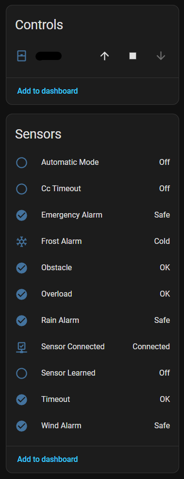

# Selve Home Server 2 Integration for Home Assistant

This custom integration is for the [Home Server 2](https://www.selve.de/home/produkte/smarthome/selve-home-server-2/sw10029/) from Selve.

Information from https://www.selve.de/service-downloads/software/

## Available entities

## Installation

Please follow [this guide](https://www.hacs.xyz/docs/faq/custom_repositories/) to add this repo as a custom repository to your Home Assistant Hacs installation.

